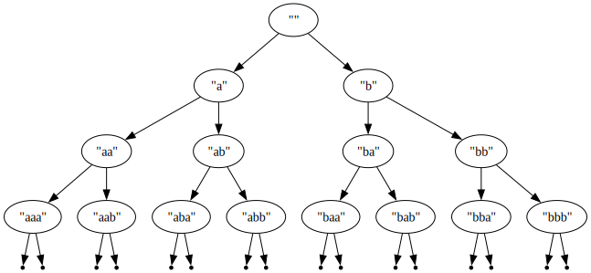

#### Потоци и лениво оценяване
В Haskell оценяването е [лениво](https://wiki.haskell.org/Lazy_evaluation).
Освен всичко останало, това означава, че няма нужда да имплементираме
конструкции като `delay` и `force`.

Съставните структури от данни (списъци, n-торки, алгебрични структури)
по подразбиране са лениви: конкретен елемент, съдържащ се в съставната
структура, ще бъде оценен чак когато бъде поискан за първи път.

От тук следва, че списъците в Haskell всъщност са еквивалентни на потоци,
и нищо не им пречи да са безкрайни:

```haskell
boings :: [String]
boings = "Boing" : boings

> take 5 boings
["Boing", "Boing", "Boing", "Boing", "Boing"]

> take 5 (map (++ "!") boings)
["Boing!", "Boing!", "Boing!", "Boing!", "Boing!"]
```

##### Задачи за потоци:

Зад. 1\. Дефинирайте константата `nats`, която е списък от всички естествени числа

Зад. 2\. Използвайки константата `nats` и функцията `filter`, дефинирайте константата `primes`, която е списък от всички прости числа

Зад. 3\. Дефинирайте константата `primes2`, която е списък от всички прости числа, и е имплементирана чрез безкрайно сито на Ератостен (както правихме на scheme)

Зад. 4\. Дефинирайте функцията `(iterate f x)`, която по дадена функция `f` връща безкрайния списък `x`, `f x`, `f (f x)`, ...

Зад. 5\. Дефинирайте константата `rats :: (Int, Int)`, която е списък от всички рационални числа, представени като двойки от числител и знаменател (такъв че всяко рационално число има свой индекс в този списък)


#### Задачи за лениви алгебрични типове:

Зад. 6\. Дефинирайте тип `BinTree a`, представящ (може би безкрайно) двоично дърво, съдържащо елементи от тип `a` във върховете си
* Ако искате, може да дефинирате подходяща инстанция `instance (Show a) => Show (BinTree a)`, която показва дървото на екрана по красив начин

Зад. 7\. Напишете функция `trimBinTree :: Int -> (BinTree a) -> (BinTree a)`, която отрязва дърво
до дадена дълбочина

Зад. 8\. Дефинирайте константата `babaTree :: BinTree String`, представяща такова безкрайно дърво:

